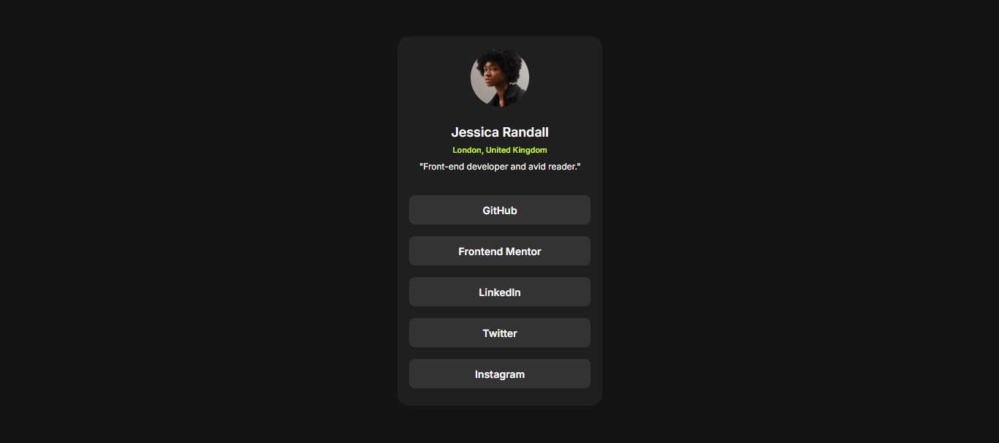

# Frontend Mentor - Social links profile solution

This is a solution to the [Social links profile challenge on Frontend Mentor](https://www.frontendmentor.io/challenges/social-links-profile-UG32l9m6dQ). Frontend Mentor challenges help you improve your coding skills by building realistic projects. 

## Table of contents

- [Overview](#overview)
  - [The challenge](#the-challenge)
  - [Links](#links)
- [My process](#my-process)
  - [Built with](#built-with)
  - [What I learned](#what-i-learned)
  - [Continued development](#continued-development)
  - [Useful resources](#useful-resources)
- [Author](#author)
- [Acknowledgments](#acknowledgments)

## Overview

### The challenge

Users should be able to:

- See hover and focus states for all interactive elements on the page

### Links

- Solution URL: [Social Links Profile HTML/CSS](https://www.frontendmentor.io/solutions/social-links-profile-htmlcss-KLGulkBpMx)
- Live Site URL: [Social Links Profile](https://maurodev35.github.io/Social-Links-Profile/)

## My process

In order to make this challenge I first added some semantic tags in the HTML code such as main and added some div tag to get a container where I can organized the social links. After this I made the CSS code in order to get everything in the right place with the right design according to the instructions, finally added some animations when hovering the social links.

### Built with

- Semantic HTML5 markup
- CSS custom properties
- Flexbox
- Mobile-first workflow

### What I learned

Today I learned how to use png icons in order to change the way the cursor shows and how to do this when hovering an object.

### Continued development

I'll keep practicing in order to improve my HTML and CSS skills as well as during the path I'm road to practice with JavaScript and eventually with React.

### Useful resources

- [Icons8](https://icons8.com/icons/set/finger-up) - This helped me to get the png icon for the cursor in order to use when hovering the social links.

## Author

- Frontend Mentor - [@MauroDev35](https://www.frontendmentor.io/profile/MauroDev35)
- LinkedIn - [Andres Mauricio Paez Vergara](https://www.linkedin.com/in/maurodev35/)

